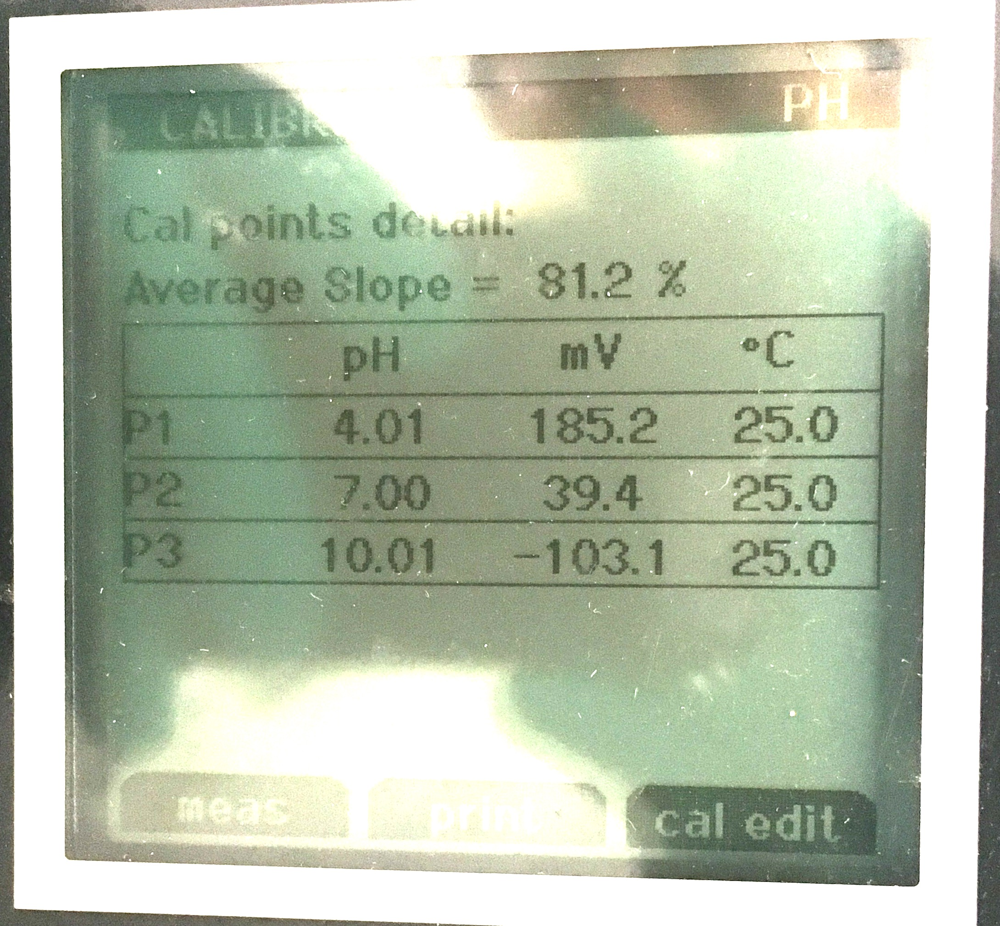

\fontsize{12}{16}
\selectfont

```{r global_options, include=FALSE}
knitr::opts_chunk$set(fig.path = 'output/', echo = TRUE, warning = FALSE, message = FALSE, cache = TRUE)
```

Working with a pH probe on 2019-08-14, its meter reported that the calibration looked like this: 

```{r echo=FALSE, out.width='50%'}

```

The meter is less likely to be in error than the probe. I've plotted this and run my own regression, which shows a much higher fit than $81.2\%$. They called this "Average Slope", but this is not an $r^2$ or other regression metric. They assume that a "good probe" will follow not only a "perfect" calibration curve, but the intercept of this curve will also have a "perfect" slope and intercept. This means no matter how straight the curve is, your probe's "average slope" can still be in error from "how a good probe should behave". This is based on Nernst potential (see below). 

```{r}
library(ggplot2)
pH <- c(4.01, 7.00, 10.01)
mV <- c(185.2, 39.4, -103.1)
df <- data.frame(x=pH, y=mV)
ggplot(df, aes(x=x, y=y, label=y)) + 
  geom_point() + geom_rug(sides="b") + 
  geom_smooth(method="lm",se=FALSE) +
  xlab("pH") + ylab("mV") + theme_bw() + 
  ylim(-120, 200) + xlim(3, 11) + 
  geom_abline(intercept = 414.12, slope = -59.16)
```

The black line is the "perfect theoretical slope": $-59.16 [\mbox{mV}/\mbox{pH}]$. [^1]

[^1]: Am I the only one dubious about the proposition that $0[\mbox{mV}]$ is $7.0[\mbox{pH}]$, *i.e.* neutral at nil? 

```{r}
summary(lm(mV~pH))
```

The model above says this probe (#1) is performing at $-48.049 [\mbox{mV}/\mbox{pH}]$. I suspect that the probe I'm using (#1) has been used enough times to warrant cleaning. Because it reports a low ($<92\%$) average slope, this does not mean that the pH values are wrong from it when using the Orion pH meter. It just means the probe behaves differently from a "fresh" one. 

On 2019-09-20, I soaked the probe tip in $5\%$ acetic acid for $1$ hour and $0.1[M]KCl$ for $20$ minutes to attempt to clean it. A tiny bubble either was there before the cleaning or began to grow as the cleaning progressed, possibly from a reaction of the acetic acid with a mineral deposit on probe #1. This probe has been used hundreds of times in soil solution extracts, which, although centrifuged of soil particles, may have still deposited a thing film of various organic or inorganic in the glass frit (liquid junction) or the surface of the bulb itself. 
