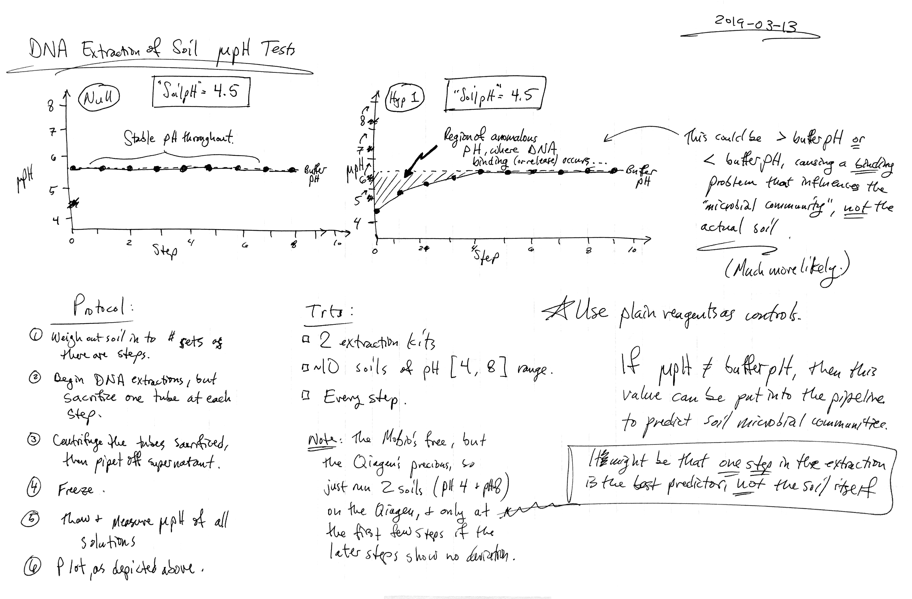
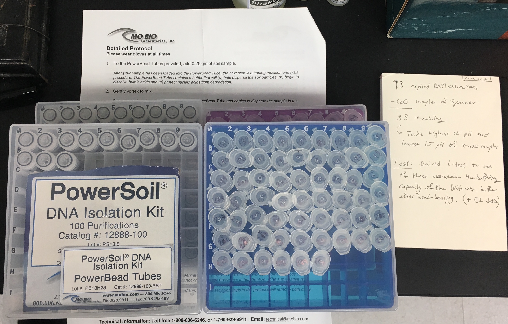
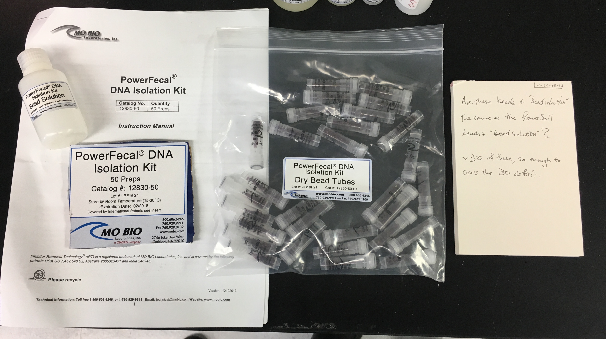
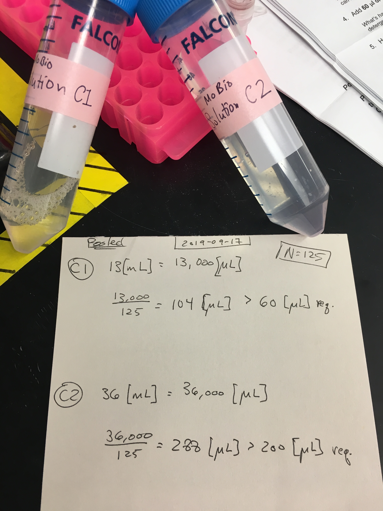
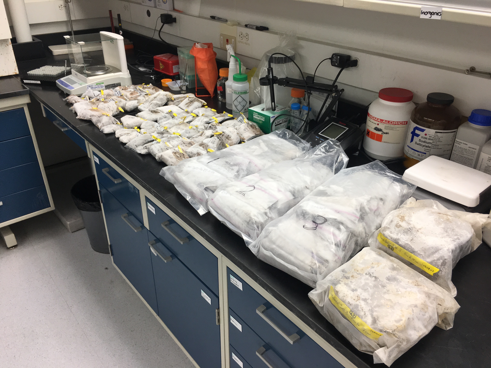
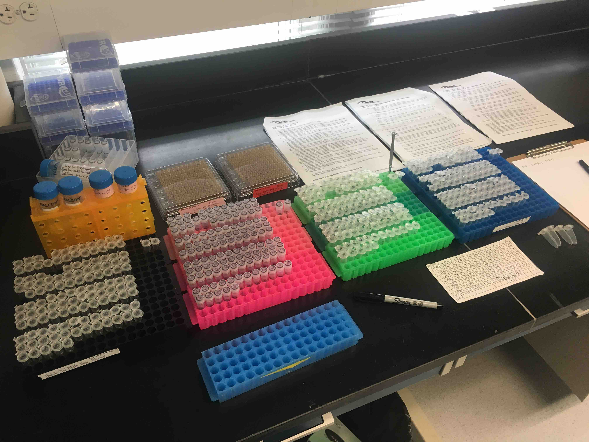
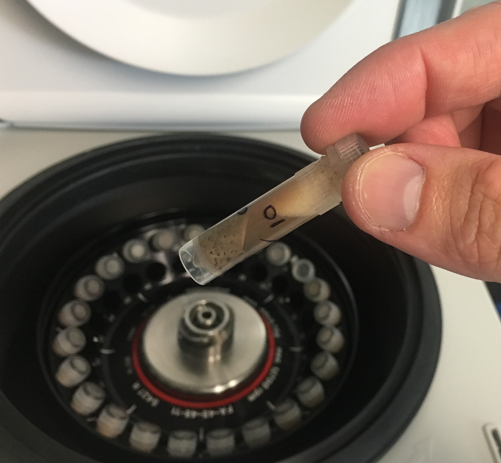
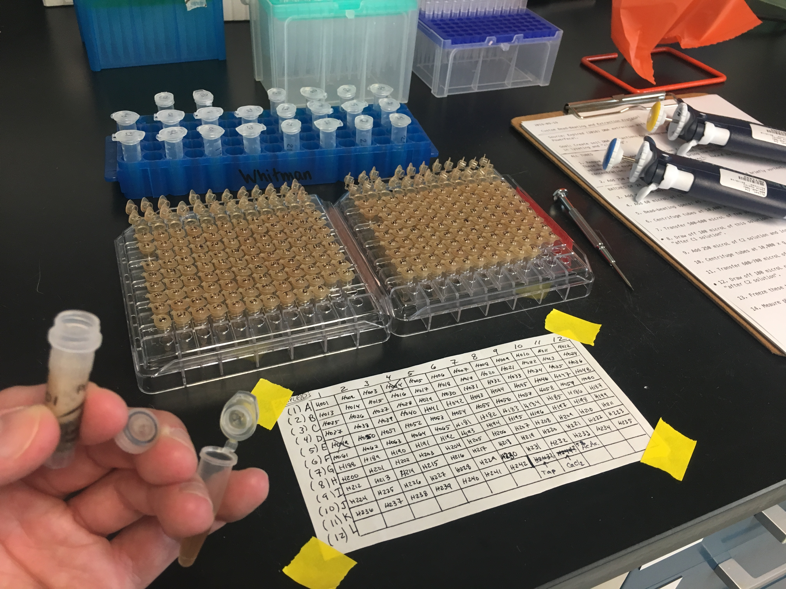

\fontfamily{pbk}
\fontsize{11}{22}
\selectfont

```{r global_options, include=FALSE}
knitr::opts_chunk$set(fig.path = 'output/', echo = FALSE, warning = FALSE, message = FALSE, cache = FALSE)
```

```{r setup, include=FALSE}
knitr::opts_chunk$set(echo = TRUE)
knitr::opts_chunk$set(dev="png", dpi=300)
```

# Introduction

The purpose of the following study was to investigate a wild hypothesis of mine that the "soil pH" values, which seem to predict soil microbial communities best, are similar to the pH of the suspensions created in the first few step.nums of the standard DNA extraction kit. 

This is the original design: 

```{r echo=FALSE, out.width='100%'}

``` 

# Soil DNA Extraction Suspensions

I inherited some expired DNA extraction kits from some folks at Marine Biological Laboratory in 2016, and the fecal and soil kits are nearly identical, at least in their first few step.nums. There were about $90$ soil extractions and about $30$ fecal extractions, which together make enough to perform DNA extractions of all $120$ samples I gathered as part of the USDA Hatch soil pH project. 

```{r echo=FALSE, out.width='80%'}

```

```{r echo=FALSE, out.width='80%'}

``` 

These indeed have the same bead-beating solution. However, because the silicone washers keeping the bead tubes sealed have differentially dried and cracked, some had different amounts of bead-beating solution. I removed these solutions from the tubes with beads and solution in them and then filled all the tubes with the same solution of the same volume. 


I pooled the C1 and C2 solutions from the soil and fecal DNA extraction kits. 

```{r echo=FALSE, out.width='80%'}

``` 

I then performed the DNA extractions again like I did for amplification and sequencing of the 16S amplicons. 

```{r echo=FALSE, out.width='80%'}

``` 

```{r echo=FALSE, out.width='80%'}

``` 

I found a clever way to get $100[\mu \text{L}]$ of solution from right after the C1 solution was added and beat as well as $100[\mu \text{L}]$ of solution from right after the C2 solution was added. The standard extraction protocol is a little vague on how much solution to transfer from one step.num to another, so I just took the excess from these step.nums, which didn't affect the extraction at all. Now I have both of the step.nums of the DNA extraction protocol that have soil present (a lot of soil in the "after C1" solutions and a little bit of soil in the "after C2" solutions). 

This is the cusom protocol. 

```{r echo=FALSE, out.width='80%'}

``` 

The first step.num of the extraction protocol makes a really dense slurry, which looks a lot like the slurry for the standard soil pH protocol. The big difference is that the soil pH protocol uses a $1:1$ soil:solution ratio by mass, whereas the DNA protocol uses roughly a $1:3$ soil:solution ratio. The buffer solution and the ratio of water and soil are both very different from the soil pH protocol, but it's worth checking out. 

```{r echo=FALSE, out.width='80%'}

``` 

These tiny solutions went into tiny tubes for freezing and pH analysis later (a month later, unfortunately). 

```{r echo=FALSE, out.width='80%'}

``` 

I then thawed and measured the pH of all these solutions. This is the standard curve to get pH values to compare to the standard soil pH. 

```{r}
standard <- c(4,7,10)
standard.mV <- c(176, 3.7, -161.5)
stcurve <- data.frame(standard,standard.mV)
summary(lm(stcurve$standard~stcurve$standard.mV))
```

$$\text{pH} = \text{mV}*-0.0177752 + 7.1078$$

```{r}
dat <- read.csv("source/data/dna-extraction-ph-vs-soil-ph.csv", header=T) 
dat$pH.exp <- 10^-dat$pH
str(dat)
hist(dat$mV, breaks = 100)
```

Looks good. 

```{r}
library(ggplot2)
dat.hatch <- subset(dat, Step!="standard")
dat.hatch$solution <- as.character(dat.hatch$solution)
dat.hatch$solution <- as.integer(dat.hatch$solution)
p <- ggplot(dat.hatch, aes(solution, pH, color=Step))
p + geom_point() + facet_wrap(~Step)
```

This tells me that the DNA extraction swings the pH wildly basic and then a little back to neutral. Let's look at a plot of the pH values by "step.num", treating standard soil pH as "step.num 0". Samples $1$ to $65$ are from across Wisconsin, whereas samples $181$ to $240$ are from a soil pH multifactorial in Spooner, WI. 

```{r}
p <- ggplot(dat.hatch, aes(pH, solution, color=Step))
p + geom_point()

```

```{r, fig.height=10, fig.width=10}
p <- ggplot(subset(dat.hatch, solution<=65), aes(step.num, pH, color=Step, shape=Step))
p + geom_point(size=3) + facet_wrap(~solution) +
  theme_bw() + theme(axis.text.x = element_text(face="bold", color="#993333", 
                           size=10, angle=35),
          axis.text.y = element_text(face="bold", color="#993333", 
                           size=10, angle=35)) +
  scale_x_discrete(name ="DNA Extraction Step (Lysate)", 
                    limits=c(0,1,2)) + theme(legend.position="none")
```

```{r, fig.height=10, fig.width=10}
p <- ggplot(subset(dat.hatch, solution<=65), aes(step.num, pH.exp, color=Step, shape=Step))
p + geom_point(size=3) + facet_wrap(~solution) +
  theme_bw() + 
  theme(axis.text.x = element_text(face="bold", color="#993333", 
                           size=10, angle=35),
          axis.text.y = element_text(face="bold", color="#993333", 
                           size=8, angle=35)) +
  scale_x_discrete(name ="DNA Extraction Step (Lysate)", 
                    limits=c(0,1,2)) + theme(legend.position="none")
```

```{r, fig.height=10, fig.width=10}
p <- ggplot(subset(dat.hatch, solution>65), aes(step.num, pH, color=Step, shape=Step))
p + geom_point(size=3) + facet_wrap(~solution) +
  theme_bw() + theme(axis.text.x = element_text(face="bold", color="#993333", 
                           size=10, angle=35),
          axis.text.y = element_text(face="bold", color="#993333", 
                           size=10, angle=35)) +
  scale_x_discrete(name ="DNA Extraction Step (Lysate)", 
                    limits=c(0,1,2)) + theme(legend.position="none")
```

```{r, fig.height=10, fig.width=10}
p <- ggplot(subset(dat.hatch, solution>65), aes(step.num, pH.exp, color=Step, shape=Step))
p + geom_point(size=3) + facet_wrap(~solution) +
  theme_bw() + theme(axis.text.x = element_text(face="bold", color="#993333", 
                           size=10, angle=35),
          axis.text.y = element_text(face="bold", color="#993333", 
                           size=8, angle=35)) +
  scale_x_discrete(name ="DNA Extraction Step (Lysate)", 
                    limits=c(0,1,2)) + theme(legend.position="none")
```

This means the bead-beating buffer plus C1 drags the pH from the somewhat neutral standard soil pH up to something around $9$, then the second step.num neutralizes that to around $8$. This is reminiscent of the akali extraction method that was used for a long time to analyze "humic acids". We can represent this as a histogram as well. 

```{r dna-lysate-ph, fig.height=8, fig.width=12}
p <- ggplot(dat.hatch, aes(step.num, pH, color=Step, shape=Step))
p + geom_point(size=3) + facet_wrap(~Sample.Index) +
  theme_bw() + theme(axis.text.x = element_text(face="bold", color="#993333", 
                           size=10, angle=35),
          axis.text.y = element_text(face="bold", color="#993333", 
                           size=10, angle=35)) +
  scale_x_discrete(name ="DNA Extraction Step (Lysate)", 
                    limits=c(0,1,2)) + theme(legend.position="none")
```

```{r dna-lysate-ph-stepwise, fig.height=8, fig.width=12}
dat.hatch.step0 <- subset(dat.hatch, Step==" standard soil pH")
dat.hatch.step1 <- subset(dat.hatch, Step==" after c1")
dat.hatch.step1$standard.pH <- dat.hatch.step0$pH
dat.hatch.step2 <- subset(dat.hatch, Step==" after c2")
dat.hatch.step2$standard.pH <- dat.hatch.step0$pH
dat.hatch.stepwise <- rbind(dat.hatch.step1, dat.hatch.step2)
p <- ggplot(dat.hatch.stepwise, aes(pH, standard.pH, label=step.num, color=Sample.Index))
p + geom_point(size=1) + theme_bw() + geom_line() +
  geom_text(aes(label=step.num, size=2),hjust=1, vjust=1) + 
  theme(axis.text.x = element_text(face="bold", color="#993333", 
                           size=10, angle=35),
          axis.text.y = element_text(face="bold", color="#993333", 
                           size=10, angle=35)) + 
  scale_x_continuous(limits = c(7.3,9.6), breaks = c(7.5,8.0,8.5,9.0,9.5)) + 
  scale_y_continuous(limits = c(4.5,8), breaks = c(4.5,5,5.5,6,6.5,7,7.5,8.0)) + 
  geom_abline(slope=1, intercept=0) + theme(legend.position="none")
```

```{r lysate-ph-histogram, fig.width=10, fig.height=4}
ggplot(dat.hatch, aes(pH, color=Step)) + geom_histogram(breaks=seq(4, 10, by = 0.1)) +
  theme_bw()
```

Now let's exponentiate it properly. 

```{r lysate-activity-histogram, fig.width=10, fig.height=4}
dat.hatch$pH.exp.nM <- 10^-dat.hatch$pH*10^9
ggplot(dat.hatch, aes(pH.exp.nM, color=Step)) + 
  geom_histogram(breaks=seq(0, 10000, by = 10)) +
  theme_bw()
```

That tells quite a different (and more accurate) story. 
